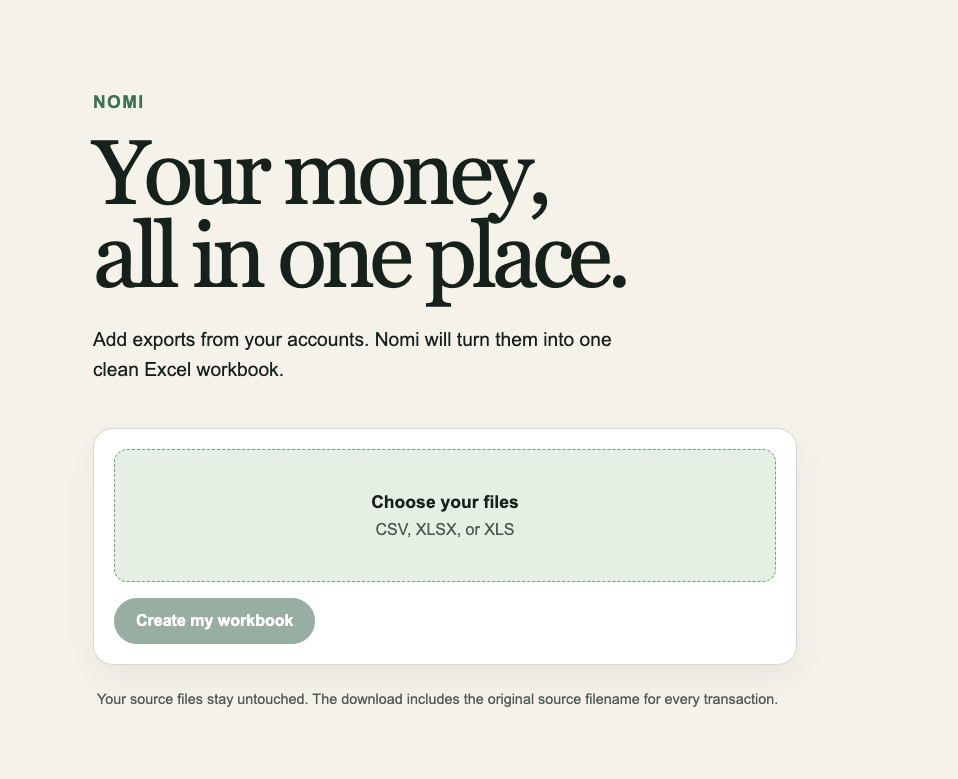

# Nomi

**Your money, all in one place.**

Nomi is a friendly, personal home for your financial life. The name feels like
“know me” and gives your money something more human than another dashboard.

Our first focus is making it easy to bring transactions together. Over time,
Nomi can grow with you beyond consolidation—without losing the calm,
approachable experience at its core.



## What Nomi is for

- Turn exported bank or financial spreadsheets into one consistent file.
- Bring transactions from multiple accounts together.
- Make the resulting data ready for review, analysis, or the next Nomi feature.

## Minimum lovable product

Nomi’s first release converts uploaded financial exports into one consolidated
Excel workbook.

1. Upload one or more `.csv`, `.xlsx`, or `.xls` files.
2. Select the relevant worksheet when an Excel file has more than one.
3. Nomi reads the rows, aligns supported transaction fields into a standard
   format, and combines them into a single dataset.
4. Download the consolidated result as an Excel workbook.

The initial experience should make the process feel effortless while being
clear about any rows or columns that cannot be interpreted. Source files are
never silently changed.

### Initial output

starting point is:
The consolidated workbook contains a `Transactions` sheet with a consistent,
documented schema:
starting point is:

| Column | Description |
| --- | --- |
| `date` | Transaction date in a consistent format |
| `description` | Merchant, payee, or transaction description |
| `amount` | Signed transaction amount |
| `currency` | Transaction currency, where supplied |
| `account` | Source account, where supplied |
| `source_file` | Original uploaded file for traceability |

The exact mapping and validation rules will be documented as support for source
formats is added.

## Product principles

1. **Personal, never patronising** — helpful guidance without judgement.
2. **Simple by default** — clarity beats financial jargon.
3. **Trust is foundational** — privacy, security, and transparency are part of
   the product, not an afterthought.
4. **Useful today, adaptable tomorrow** — make consolidation excellent, then
   support the wider financial picture over time.

## Status

Nomi is in its early setup stage. The first milestone is a reliable file-to-file
conversion flow: CSV or Excel in, one consolidated CSV out.

## Stack

- React + Next.js for the upload and download experience
- Python + FastAPI for parsing and normalising exports
- PostgreSQL for consolidation-job history

## Getting started

With Docker installed, start the full application with:

```bash
docker compose up --build
```

Open `http://localhost:3000`, select one or more `.csv`, `.xlsx`, or `.xls`
exports, and download the combined workbook. The API is available at
`http://localhost:8000`.

## Contributing

When contributing, keep the Nomi voice warm, concise, and clear. Prefer plain
language over financial jargon, and design every decision around helping people
feel more at home with their money.

---

Made for a clearer relationship with money.
